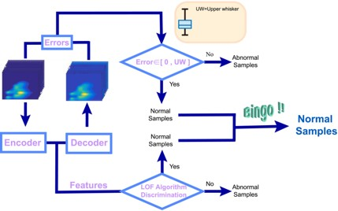

# ARIM-Academy：　機器データ利活用ユースケース
### 機器：蛍光分光光度計　（励起-蛍光マトリクス3次元蛍光法）

### 分析：1 クラス分類アルゴリズム畳み込みオートエンコーダ (OC-CAE)

## データセット
本データセット「ツバキ油データセット」（CAO.mat）は、純正のツバキ油およびそれに異なる割合で混入された大豆油（SBO）、ピーナッツ油（PO）、ヒマワリ油（SO）の二元混合油サンプルに関するEEM（励起-発光マトリックス）蛍光スペクトルデータです。本データセットは、食品の真正性検証に関する研究に使用され、ツバキ油の偽造検出を目的としています[1]。  

このデータセットを用いた研究では、異常検出のための1クラス分類アルゴリズムである1クラス畳み込みオートエンコーダ（OC-CAE）を使用します。OC-CAEは、再構成誤差の解析にBoxplotを使用し、CAEの隠れ層で抽出された特徴を用いて局所外れ値因子（LOF）アルゴリズムを適用し、食品の真正性を識別します。  

[1]  Xiaoqin Yan, Baoshuo Jia, Wanjun Long, Kun Huang, Tong Wang, Hailong Wu, Ruqin Yu  "A Novel One-Class Convolutional Autoencoder Combined With Excitation–Emission Matrix Fluorescence Spectroscopy for Authenticity Identification of Food", Journal of Chemometrics, e3592 (2024)  
https://doi.org/10.1002/cem.3592c02495

---
   

 

---